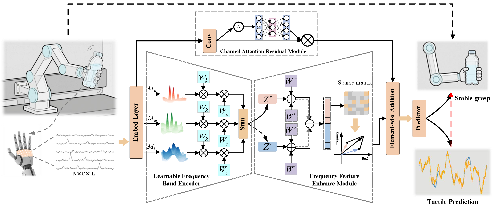

# FTFNet: A Frequency–Time Fusion Network for Slip Prediction in Dexterous Robotic Manipulation

<p align="center">
  
</p>

<p align="center">
  <em>Figure 1: The architecture of the proposed FTFNet.</em>
</p>

---

This repository contains the official implementation of the **FTFNet** architecture and the associated **sp-dataset** for tactile data processing, as described in our paper. This project aims to provide a reproducible pipeline for tactile sensing research.

## 📁 Repository Structure

The repository is organized as follows:

```text
.
├── model/
│   └── FTFNet.py             # Implementation of the proposed FTFNet architecture
├── dataset.py                # Data loading, augmentation, and dataset splitting logic
├── main.py                   # Main script for training, evaluation, and inference
├── sp-dataset.zip            # Compressed tactile dataset (experimental data)
├── tool/                     # Prediction result metric calculation and curve plotting 
├── results_FTFNet_loto/      # Results from Leave-One-Task-Out (LOTO) cross-validation
│   ├── [checkpoints]         # Trained model parameters (.pth files)
│   └── normalizer_params.json # Data normalization parameters (mean, std, etc.)
└── README.md                 # Project documentation

🚀 Getting Started
1. Environment Setup
Please ensure you have the following dependencies installed:
Python 3.10
PyTorch 2.5.1

2. Data Preparation
The tactile dataset is provided in a compressed format. Before running the code, unzip the file:

unzip sp-dataset.zip

Ensure the extracted data folder is placed in the root directory or as specified in dataset.py.
3. Running the Code
To start the training or evaluation process, run the main.py script:

python main.py

🧠 Key Components
FTFNet (model/FTFNet.py): This is the core model proposed in our paper. It is designed to process tactile information effectively.
Dataset (dataset.py): Handles the entire data pipeline, including:
Data loading from the sp-dataset.
Data Augmentation techniques to improve model robustness.
Dataset Splitting (training, validation, and testing sets).
LOTO Results (results_FTFNet_loto/):
This directory contains saved model weights from the Leave-One-Task-Out cross-validation experiments.
normalizer_params.json stores the scaling factors used during training, ensuring consistent data preprocessing during inference.

📊 Experiments & Reproducibility
The provided code and resources allow for the full reproduction of the results reported in the paper. By using the scripts in this repository and the provided model checkpoints, you can verify the performance of FTFNet on the SP-dataset.

📧 Contact

For any questions regarding the code or dataset, please open an issue or contact: xy_l@tongji.edu.cn.
